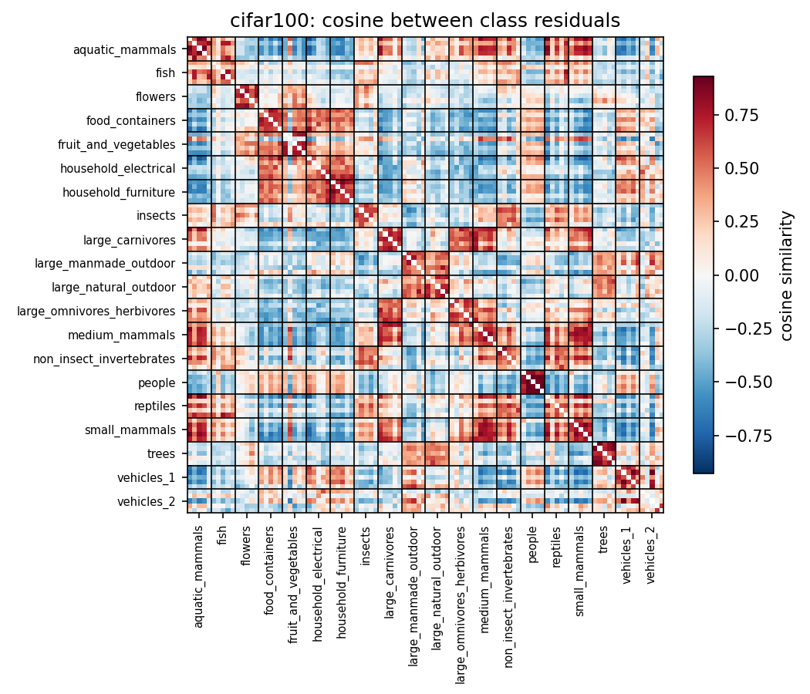
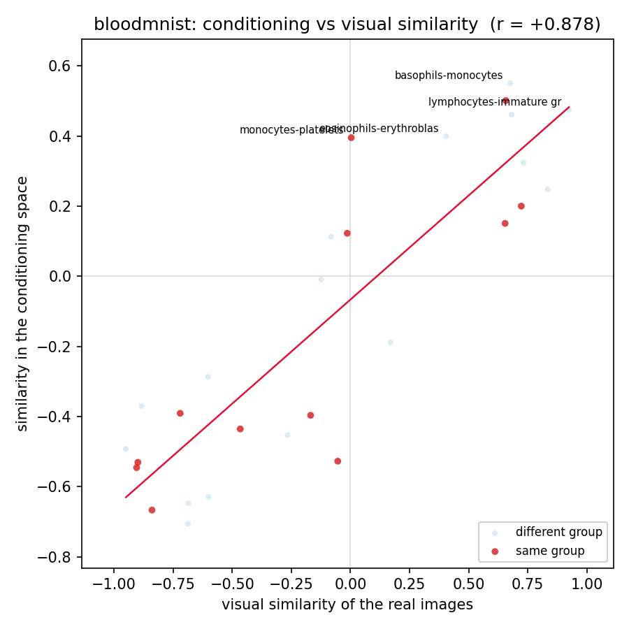
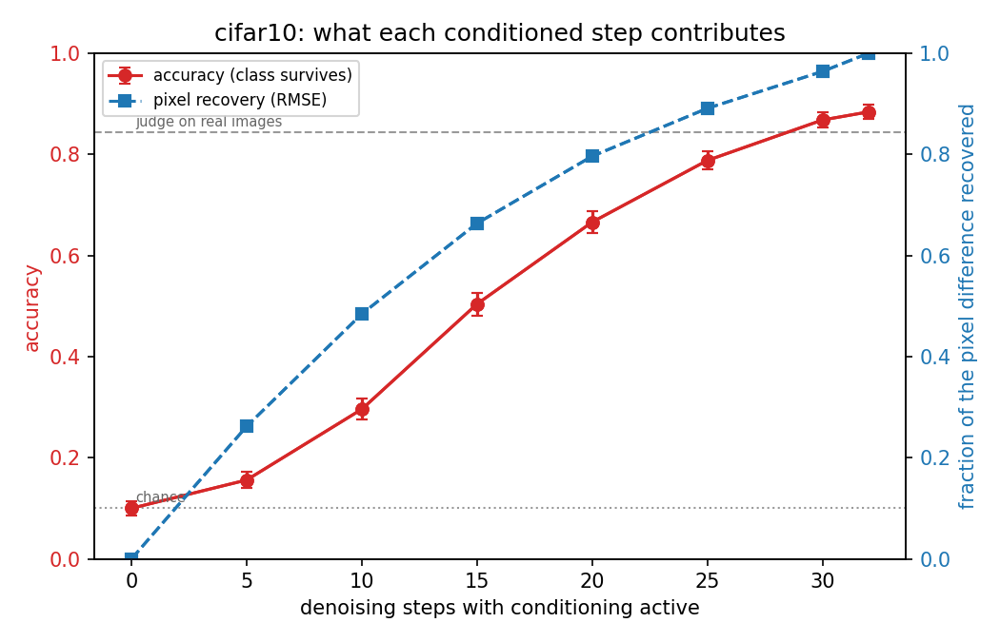
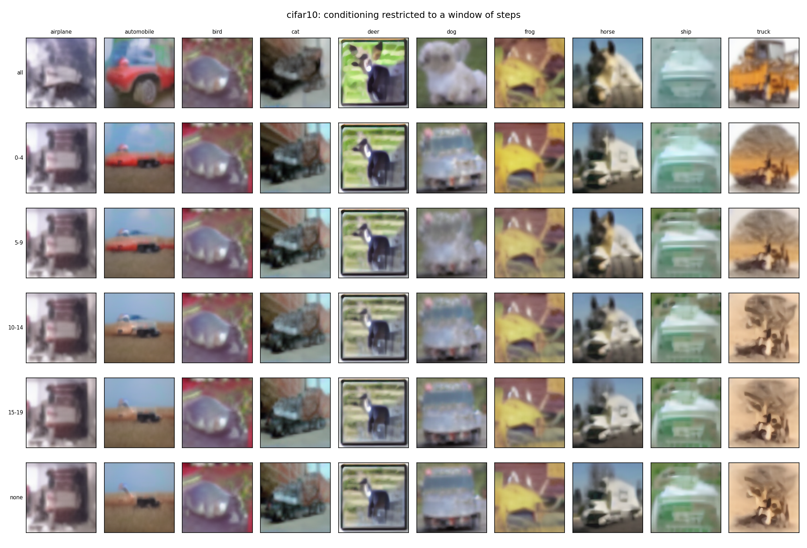
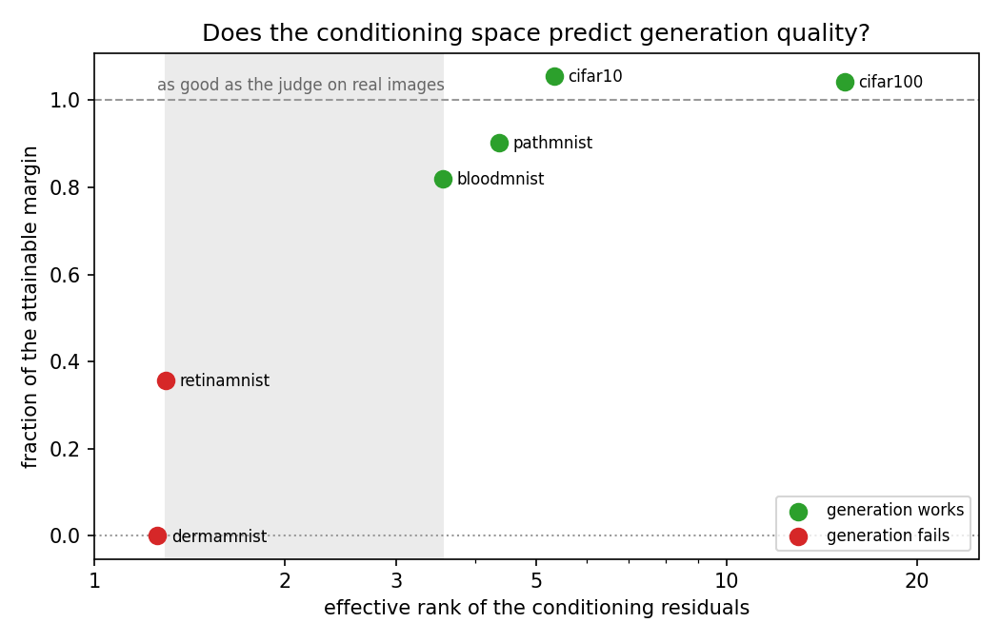
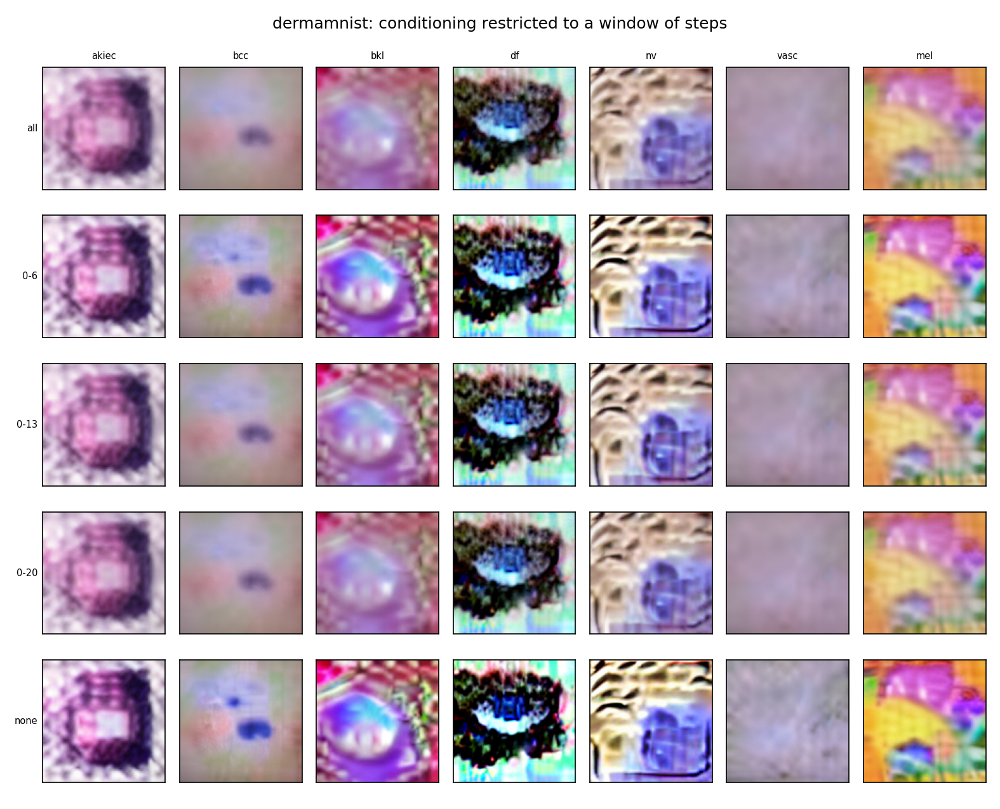

# xAI — Explaining the generator

Explainability analysis of the class-conditional generator described in
[setup.md](setup.md). The paper shows **that** the adaptation works and **that**
UGS and the adaptation epoch dominate the fANOVA. This work answers **why**, across
all six datasets.

For environment, weights and CUDA setup see the [main README](setup.md): this
document assumes `sd_dataset` is active and the `DiffusionFt` weights are in place.

---

## The questions

1. **What** does the space where class conditioning lives contain?
2. **Where** does conditioning act on the image?
3. **When** does it act, during the denoising process?
4. Can we tell **in advance** whether an adapted generator will work at all?

---

## Results

### 1. The conditioning space reproduces the visual geometry of the real data

The `ClassEncoder` is two `Dense` layers with no activation, hence an **affine map**:
`context(x) = xE + u`, with `E = W1W2` and `u = b1W2`. Class embeddings can be read
straight from the weights, without generating anything, and the unconditional context
used by classifier-free guidance is exactly `u` — so the direction guidance amplifies
is `E[c]`, the c-th row.

| dataset | energy shared by all classes | Mantel vs real visual similarity | p |
|---|---|---|---|
| bloodmnist | 98.8% | **+0.878** | 0.0001 |
| cifar100 | 97.7% | **+0.459** | 0.0001 |
| cifar10 | 96.6% | **+0.776** | 0.0004 |
| retinamnist | 93.3% | +0.735 | 0.0919 |
| pathmnist | 87.4% | +0.242 | 0.0767 |
| dermamnist | 87.0% | **+0.828** | 0.0216 |

Between 87% and 99% of the conditioning is **identical for every class**; the
discriminative information lives in what remains. Within that residual, class
similarity matches the similarity of the real images on four datasets out of six —
starting from mutually orthogonal one-hot vectors, having never seen words or
categories.

On CIFAR-10 the vehicles/animals split is the best of all 210 possible partitions
(p = 0.0048, the smallest attainable); on CIFAR-100 the twenty superclasses separate
six times better than the best of ten thousand random groupings.

**BloodMNIST is the instructive case.** The haematological taxonomy *fails*
(p = 0.77, with a negative separation) while visual similarity gives the highest
correlation of all six. Giemsa staining exists precisely to make biologically sibling
cells look different — so the wrong reference was the taxonomy, not the model. The
space encodes **appearance**, not conceptual kinship, which is also why `clock↔plate`
and `crocodile↔beaver` come out as close pairs on CIFAR-100.

PathMNIST and RetinaMNIST do not reach significance. On PathMNIST the likely reason
is the descriptor rather than the model: histology images are textures, and a
per-class mean image describes them poorly. Reported as a limitation, not as a
refutation.



*CIFAR-100: cosine between class residuals, classes ordered by official superclass.
Twenty red blocks sit on the diagonal, one per superclass. But there is also a second
level nobody supplied: indoor objects cluster together, and so do mammals and
reptiles — a nested taxonomy that CIFAR-100 does not even define, emerging from a
hundred orthogonal one-hot vectors.*



*BloodMNIST: conditioning similarity against visual similarity of the real images,
one point per class pair. Red points are pairs within the same haematological group —
scattered rather than gathered at the top, which is the p = 0.77 of the taxonomy test
made visible. The overall correlation is nonetheless +0.878, the highest of the six
datasets: the space tracks appearance, and on this dataset appearance and taxonomy
disagree.*

### 2. Cross-attention does not localise (negative result)

The UNet's cross-attention maps do **not** provide a spatial localisation of class
conditioning. Three independent measurements:

- the aggregated maps are nearly uniform (max/mean between 1.05 and 1.17 at every
  resolution and at both ends of denoising) while the distance itself sits around
  0.25–0.30 everywhere: the class changes how the context is read by a quarter of the
  whole distribution, uniformly, with no spatial structure;
- per-head selectivity does exist — CV up to 1.28 — but that peak is at the *first*
  step, when the latent still holds pure noise and there is nothing to localise. At
  the last step the sharpest head reaches 0.54, its map is speckle at the scale of a
  single grid cell, and it correlates **negatively** with local detail (−0.428): it
  attends to the flat background, not to the subject;
- across all 128 (layer, head) pairs the profile of detail-following is nearly the
  same with and without conditioning — r = 0.85 for detail, r = 0.82 for luminance —
  so what these heads track is a property of the UNet's cross-attention, not a trace
  of the class.

**The reason is structural.** In text-driven Stable Diffusion there is a `cat` token
that binds to a region, which is what makes DAAM possible. Here the `ClassEncoder`
emits a hundred slots in one block from a one-hot vector — there is no "ears" slot.
Conditioning is a global vector, and a global vector has nothing to localise. It is
the direct consequence of the geometry measured in Result 1.

A by-product worth noting: **ten slots out of a hundred receive 93–96% of the
attention** — the single most attended one takes about a quarter on its own — and they
are largely the same ten throughout denoising.

### 3. Class identity is built midway through denoising (main result)

`eps(c) - eps(0)` **is** the class signal by definition: the only channel through
which the class reaches generation, and exactly what guidance multiplies by UGS. Its
instantaneous strength is **weak while the image is still noise** and grows almost
fivefold along the process — which suggests conditioning matters most at the end, and
is wrong.

An intervention settles it: generate with conditioning confined to a window of steps,
from the same initial noise, and judge the result with a ResNet20 trained on real
data only.

| dataset | judge on real | `all` | chance | peak of the bell |
|---|---|---|---|---|
| cifar10 | 84.3% | **88.4%** | 10.0% | 3rd block of 7 |
| pathmnist | 88.5% | 81.0% | 11.3% | 3rd of 5 |
| bloodmnist | 95.7% | 80.8% | 10.0% | 2nd of 4 |
| cifar100 | 62.5% | **65.2%** | 1.0% | 2nd of 4 |
| retinamnist | 45.8% | 29.2% | 17.0% | inconclusive |
| dermamnist | 75.8% | 14.3% | 14.9% | no effect |

Contribution of each block, class accuracy against pixel recovery:

```
cifar10     class  +5.6 +14.0 +20.8 +16.2 +12.2 +8.0 +1.6
            pixel  26.2  22.2  17.9  13.3   9.5  7.3  3.6
cifar100    class +10.2 +25.8 +17.6 +10.6
            pixel  41.7  30.4  16.7  10.3
pathmnist   class +12.7 +14.8 +18.6 +17.8 +5.8
            pixel  36.8  24.1  19.5  14.9  4.7
bloodmnist  class +15.5 +24.0 +17.3 +11.0 +3.0
            pixel  35.1  28.8  19.1  12.7  4.3
```

**Pixel recovery falls monotonically; class accuracy traces a bell**, on all four
datasets where generation works:

> Conditioning reshapes the image mostly in the **early** steps, but carries **class
> identity** mostly in the **middle** of denoising. The first steps decide *what image
> this will be* — composition, background, dominant colours; the middle ones decide
> *what it is an image of*; the last ones refine without adding class.



*CIFAR-10. Pixel recovery (blue) is concave — steep, then flattening. Accuracy (red)
is S-shaped: almost flat at first, steepest in the middle. At five conditioned steps a
quarter of the pixel distance is already covered while accuracy is barely above
chance. The red curve ends above the dashed line, i.e. above the judge's accuracy on
real images.*



*Same class, same initial noise, only the number of conditioned steps changes. The
`0-4` row is nearly indistinguishable from `none` — the dog is still a blue vehicle,
the ship a green bottle. Note also that the last four rows look alike yet span twenty
points of accuracy: judging these by eye is not enough, which is why the class is
scored by a classifier.*

Two things worth noting. On CIFAR-10 and CIFAR-100 the generated images **beat the
judge on real ones** (88.4% vs 84.3%, 65.2% vs 62.5%): the generator produces
prototypical examples while the real dataset holds occlusions, crops and ambiguous
cases. It is the mechanism behind the paper's finding that in a third of cases
classifiers trained on synthetic data outperform those trained on real data. And
moving from (IS 20, UGS 1.0) to (IS 31, UGS 1.752) is worth **24 accuracy points** —
an independent confirmation, on a different metric, of the weight the paper's fANOVA
assigns to these two hyper-parameters.

**Sanity checks** (run at UGS = 1.0, where guidance reduces to `eps(c)`):

| context | vs requested label | vs supplied embedding |
|---|---|---|
| trained encoder | 64.4% | — |
| **embeddings permuted** (c → c+1) | **5.6%** | **65.0%** |
| untrained encoder | 9.0% | — |
| chance | 10.0% | |

The permuted run is the sharp one: giving every class the next class's embedding does
not break generation, it **redirects** it, with undiminished effectiveness. And
accuracy on the requested label falls *below* chance, since with that shift the
requested class is never produced on purpose. A pipeline artefact would survive
randomisation; it would not survive this.

### 4. The effective rank tells in advance whether it will work

| dataset | effective rank | `all` | chance | margin over chance |
|---|---|---|---|---|
| cifar100 | **15.35** | 65.2% | 1.0% | +64.2 |
| cifar10 | **5.33** | 88.4% | 10.0% | +78.4 |
| pathmnist | **4.36** | 81.0% | 11.1% | +69.9 |
| bloodmnist | **3.56** | 80.8% | 12.5% | +68.3 |
| retinamnist | **1.29** | 29.2% | 20.0% | +9.2 |
| dermamnist | **1.26** | 14.3% | 14.3% | 0.0 |

Above 3.5 generation works, below 1.3 it fails, and no dataset falls in between. The
number is computed from the encoder weights alone, in seconds, **without generating a
single image** — a diagnostic rather than a post-hoc explanation.



*Points are coloured by the outcome, never by the rank: colouring by the predictor
would assume what the figure is meant to show. The shaded band is the observed gap —
from the highest rank among the failures to the lowest among the successes — so it is
a measurement, not a chosen threshold. Two datasets sit above 1.0, meaning their
generated images are classified more accurately than the real ones.*

Three cautions. It is the **absolute** rank that matters, not the normalised one:
CIFAR-100 sits at 15.35/99 = 0.155, below RetinaMNIST's 0.32, yet generates well. The
relation is a **threshold**, not a correlation (Spearman 0.66, p ≈ 0.16 over six
points). And six points with two failures are few: any threshold between 1.3 and 3.5
would separate them.

**DermaMNIST is the limiting case.** Its optimal Class-Encoder epoch is 5, against
28-41 for the others — selected because it maximised CAS, but with that little
training the encoder never learned to tell the classes apart (`df↔mel` +0.979,
`akiec↔mel` +0.910). The generated images are fluorescent artefacts, and
`generate_dataset.py`, the paper's own script, produces the same ones: it is not a
defect of this code. `all` = 14.3% is exactly 1/7, the judge assigning everything to
one class.



*DermaMNIST, conditioning restricted to a window of steps. The images are not skin
lesions but fluorescent artefacts, and the `all` row is indistinguishable from
`none`: there is no conditioning effect to measure. The effective rank of 1.26 had
predicted exactly this, from the encoder weights alone.*

On RetinaMNIST the classes are **ordinal** (retinopathy grades 0-4), so one would
expect `Grade0≈Grade1` and `Grade3≈Grade4`. Instead the closest pair is
`Grade1↔Grade4` (+0.824) and `Grade0` has a negative cosine with every other class:
the encoder did not learn even the ordering.

---

## Hypotheses that did not survive

Reported because they are results, and because they are what makes the rest
defensible:

1. **CIFAR-100's low CAS is explained by a compressed conditioning space** — no: an
   artefact of the class count. Subsampling to 10 classes gives 5.90 ± 0.56 against
   CIFAR-10's 5.33.
2. **The amount of discriminative signal predicts CAS** — no: no monotone relation
   (BloodMNIST has the smallest residual, 1.2%, and among the highest CAS).
3. **Cross-attention is a saliency map of the generator** — no, by three independent
   measurements.
4. **One can save 25% of the guidance cost by conditioning half the steps** — no: the
   accuracy curve does not saturate.
5. **The contribution is largest in the early steps** (inferred from RMSE) — no: RMSE
   was the misleading measurement, the peak is in the middle.

---

## How to reproduce

```bash
conda activate sd_dataset
```

Optimal hyper-parameters (after fine-tuning), used in every final run:

| dataset | enc | dif | IS | UGS | classes | window | per_class |
|---|---|---|---|---|---|---|---|
| cifar10 | 31 | 10 | 31 | 1.752 | 10 | 5 | 50 |
| cifar100 | 41 | 10 | 28 | 2.089 | 100 | 7 | 5 |
| pathmnist | 28 | 9 | 48 | 1.856 | 9 | 12 | 55 |
| dermamnist | 5 | 10 | 27 | 0.6497 | 7 | 7 | 70 |
| bloodmnist | 35 | 8 | 44 | 1.5162 | 8 | 11 | 50 |
| retinamnist | 31 | 7 | 30 | 1.0780 | 5 | 7 | 100 |

`per_class` is calibrated on the class count so that every configuration holds about
500 images: five per class on CIFAR-100, a hundred on RetinaMNIST. Getting it wrong
costs hours — with `--per_class 50` CIFAR-100 would generate five thousand images per
configuration.

**Results 1 and 4** need no GPU and take seconds:

```bash
python -m scripts.xai_conditioning --dataset cifar10 --exp xAI --enc_epoch 31
python -m scripts.xai_figures      --dataset cifar10 --exp xAI --enc_epoch 31
```

**Result 2**, the attention machinery:

```bash
python -m tools.xai_inspect_unet
python -m scripts.xai_test_capture
python -m scripts.xai_test_stability
```

The last two write `XAI_Results/Exp_<exp>/<dataset>/attention/uniformity.npz` and
`stability.npz`, which `notebooks/02_attention.ipynb` reads back without a GPU.

**Result 3**, the intervention (about an hour per dataset):

```bash
python -m scripts.xai_guidance --dataset cifar10 --exp xAI --enc_epoch 31 --dif_epoch 10 \
    --steps 31 --ugs 1.752
python -m scripts.xai_windows  --dataset cifar10 --exp xAI --enc_epoch 31 --dif_epoch 10 \
    --steps 31 --ugs 1.752 --window 5 --per_class 50 --chunk 100
python -m scripts.xai_score    --dataset cifar10 --exp xAI --npz steps31_window5.npz
python -m scripts.xai_sanity   --dataset cifar10 --exp xAI --enc_epoch 31 --dif_epoch 10
```

Artefacts go to `XAI_Results/Exp_<exp>/<dataset>/`, git-ignored because
`.gitattributes` would send every `.npz` to Git LFS. Result 3 needs the classifier in
`Checkpoints/Classifiers/resnet20/<dataset>/real/`. Mind the disk: the cluster home
has a 250 GB quota, filled once already.

---

## Code layout

| file | role |
|---|---|
| `XAI/common.py` | datasets, semantic groups, artefact paths |
| `XAI/conditioning.py` | closed form, geometry, permutation and Mantel tests |
| `XAI/attention.py` | map aggregation, per-head selectivity |
| `XAI/instrumentation.py` | attention capture, eager sampling loop, chunked generation |
| `XAI/scoring.py` | the ResNet20 judge and its preprocessing |
| `XAI/plotting.py` | figures |
| `XAI_Results/` | generated artefacts, git-ignored — see [artefacts.md](artefacts.md) |
| `scripts/xai_*.py` | entry points, one per experiment |
| `tools/` | one-off diagnostics: UNet reconnaissance, GPU and linearity checks |
| `notebooks/` | Results 1, 2 and 3, on stored artefacts, without a GPU |

Paths in this table are relative to the repository root. Entry points import the
project's packages and read `Checkpoints/` and `Data/` by relative path, so they
are run as modules from the root — `python -m scripts.xai_windows …` — and not as
`python scripts/xai_windows.py`, which would fail on the imports.

---

## Four traps, and how they were handled

**The `ClassEncoder` swallows loading errors.**
[`class_encoder.py:19-22`](../Models/class_encoder.py) catches the exception, prints a
warning and **carries on with random weights**. A wrong path produces not a crash but
a full analysis of pure noise, looking perfectly plausible. Every script checks the
checkpoint exists before loading it. In `scripts/xai_sanity.py` the same behaviour is
exploited deliberately, and the log says so.

**TensorFlow uses TF32 on recent GPUs.**
`float32` matmuls run with a 10-bit mantissa: the model sits `4.1e-4` from a `float64`
reference, our closed form `3.9e-6`. The formula is therefore *more accurate than the
model*, and is used as the reference. Every run of `scripts/xai_conditioning.py` re-checks
this before computing anything.

**Attention weights cannot be captured in graph mode.**
`predict_on_batch` wraps the model in a `tf.function`, inside which the collected
tensors would be symbolic placeholders from the tracing pass. Hence
`instrumentation.generate` rewrites the sampling loop in eager mode. Measured cost:
**1 level out of 255** of difference on the final image.

**The judge's preprocessing.**
The ResNet20 was trained with `Rescaling(1./255)` on images loaded at native
resolution with bilinear interpolation. Any other normalisation yields low accuracies
that *look* like a finding and are a bug — which is why `scripts/xai_score.py` always first
verifies accuracy on the real test set.

---

## Technical details worth reporting

- **The number of steps executed is not the number requested.**
  `tf.range(1, 1000, 1000 // num_steps)` yields 32 values for 31, 45 for 44, 50 for
  48. This applies to the paper's optimal values too, since they go through the same
  function.
- **PathMNIST has domain shift.** Its 98.9% `Best Score` is *validation* accuracy;
  on the test set — collected at a different clinical centre — the judge scores 88.5%.
  The real ceiling is 88.5%.
- **The gate's bias criterion was revised.** Comparing the bias to the noise standard
  deviation is meaningless when the noise is itself a few `float32` ULPs (RetinaMNIST,
  context scale 1.74). The threshold is now anchored to the arithmetic
  (`|bias|/scale < 5ε`) rather than to the observed value; on the other five datasets
  the original criterion still holds on its own.

---

## Declared limitations

- The **sanity checks** run at UGS = 1.0, where guidance reduces to `eps(c)` and
  replacing the conditional context alone suffices. At UGS ≠ 1 the unconditional
  context also reaches the output and would have to be replaced too.
- The visual descriptor in the Mantel test is the **per-class mean image**,
  deliberately crude. On CIFAR it understates the correspondence; on PathMNIST, whose
  classes are textures, it is probably the reason the test does not reach
  significance.
- **RetinaMNIST is inconclusive** for Result 3: with five classes and a 45.8% ceiling,
  only 26 points separate ceiling from chance, and the experiment lacks resolution.
- Result 4 rests on **six datasets with two failures**. The separation is clean but
  the sample is small.
- The code instantiates the **Stable Diffusion 1.x** UNet (768-dim context, 8 heads,
  16 attention blocks) while the paper states SD 2.0. To be clarified.
